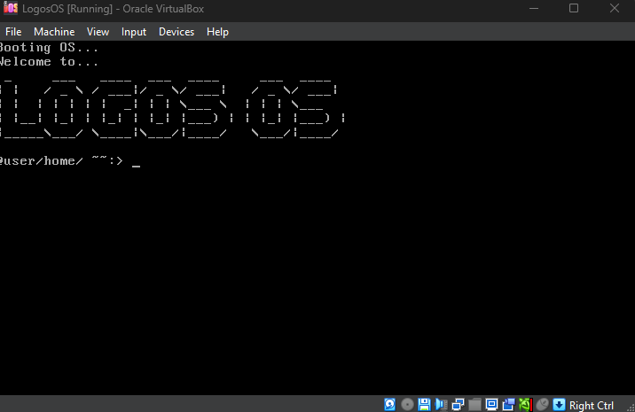

# Logos OS
16 bit DOS project from scratch. This project is a simple operating system that can boot from a floppy disk or USB drive. It is written in assembly language and C++. The goal of this project is to learn how to write an operating system from scratch and to understand how the computer works at a fundamental level. The project is still in development and is not yet complete.

## Roadmap

### Bootloader
- [x] Create boot sector
- [x] Configure 16-bit real mode
- [x] Initialize data and stack segments
- [x] Set up stack
- [x] Display text through BIOS
- [ ] Load additional sectors from disk
- [ ] Load kernel from disk

### Kernel
- [ ] Transition from bootloader to kernel
- [ ] Screen driver
- [ ] Keyboard input
- [ ] Interrupt handling
- [ ] Memory management
- [ ] Hardware abstraction

### File System
- [ ] Design file system
- [ ] Read files from disk
- [ ] Write files to disk

### User Interface
- [ ] Command-line shell
- [ ] Command parsing
- [ ] Basic commands
- [ ] User programs

### Process Management
- [ ] Process creation
- [ ] Context switching
- [ ] Multitasking

## What I have learned
- CPU architecture
    - reading and writing to memory registers
    - different hex memory addresses
- Assembly language

## How to use
In the `build` folder there is an `.img` file that can be used with an emulator like QEMU, Bochs, or VirtualBox. You can also write it to a USB drive and boot from it.

